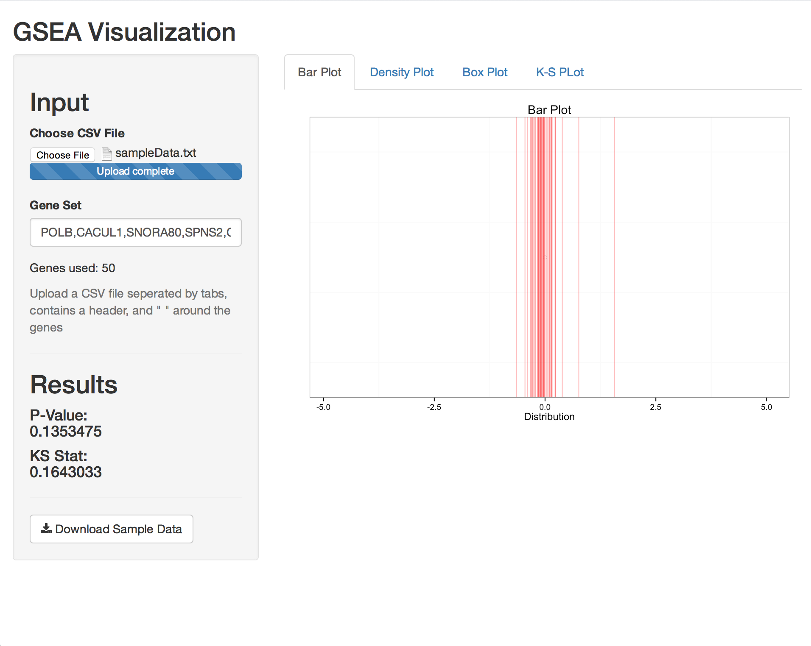

# Gene Set Evaluation Analysis
GSEA Visualization

Upload data in CSV format with a header and collums seperated by tab. In the gene set input box, input all the genes you wish to put in the gene set for testing. A sample document is available for reference. 

### Sample of What the Shiny Web application looks like

